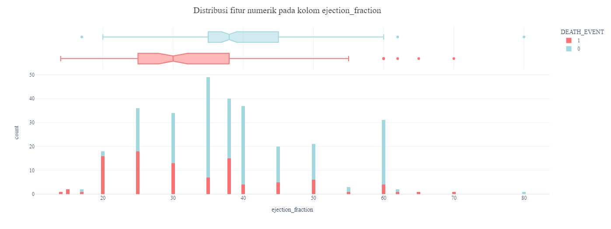
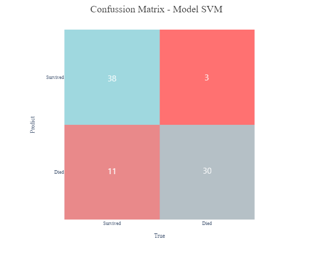

# Laporan Proyek Machine Learning - Ferry Ardianto Rismawan

## Domain Proyek
Domain proyek yang dipilih dalam proyek *machine learning* ini adalah mengenai **Kesehatan** dengan judul proyek "Prediksi Kemungkinan Kematian Akibat Gagal Jantung".
* Latar Belakang

  

Penyakit kardiovaskular atau _cardiovascular disease_ (CVD) merupakan penyebab utama kematian secara global dengan korban sekitar 17,9 juta jiwa setiap tahun. CVD ialah sekelompok gangguan penyakit jantung dan pembuluh darah, termasuk penyakit jantung koroner, penyakit serebrovaskular, penyakit jantung rematik dan kondisi lainnya. Lebih dari empat dari lima kematian CVD disebabkan oleh gagal jantung dan stroke, dan sepertiga dari jumlah kematian ini terjadi sebelum waktunya pada orang di bawah usia 70 tahun [[1](https://www.who.int/en/news-room/fact-sheets/detail/cardiovascular-diseases-(cvds))]. Namun, mengingat pentingnya organ vital seperti jantung, memprediksi penyakit gagal jantung telah menjadi prioritas dibidang kesehatan, tetapi hingga saat ini dalam praktik klinis peramalan terkait gagal jantung umumnya gagal mencapai akurasi yang tinggi [[2](https://www.sciencedirect.com/science/article/abs/pii/S1053249819309738)].

Pada konteks ini, rekam medis pasien dapat dianggap sebagai sumber informasi yang berguna untuk mengetahui korelasi dan hubungan yang tersembunyi dan tidak jelas antara data pasien, baik untuk penelitian maupun praktik klinis [[3](https://onlinelibrary.wiley.com/doi/full/10.1002/ehf2.12439), [4](https://www.scielo.br/j/ijcs/a/CkF7ycNBGDfFPpQgvKvByGS/?format=html&lang=en)]. Pendeteksian dini pada pasien yang mengidap CVD dan perawatan yang tepat diharapkan dapat mencegah kematian dini tersebut. Oleh karena itu, dibuat model _machine learning_ untuk mengklasifikasikan data rekam medis pasien untuk memprediksi kemungkinan kematian akibat gagal jantung pada masa penanganan pasien. Dengan adanya model _machine learning_ ini diharapkan dapat membantu pihak rumah sakit dalam menilai tingkat keparahan pasien dengan penyakit kardiovaskular. Implementasi model ini nantinya dapat dijalankan pada aplikasi web ataupun android.

## Business Understanding

### Problem Statements
Berdasarkan latar belakang di atas, dapat diperoleh rumusan masalah sebagai berikut:
* Bagaimana cara melakukan pra-pemrosesan data rekam medis penyakit jantung agar dapat digunakan untuk membuat model yang baik?
* Bagaimana membuat model *machine learning* untuk mengklasifikasikan kemungkinan kematian akibat penyakit gagal jantung?

### Goals
Berikut adalah tujuan proyek ini:
* Melakukan pra-pemrosesan data rekam medis penyakit jantung yang baik agar dapat digunakan dalam membuat model.
* Membuat model _machine learning_ untuk mengklasifikasikan kemungkinan kematian akibat penyakit gagal jantung yang memiliki tingkat akurasi lebih dari 90%.

### Solution statements
Solusi untuk memenuhi tujuan dari proyek ini, di antaranya:
* Pada tahap pra-pemrosesan data dapat dilakukan beberapa teknik, seperti:
  * Mengatasi data yang jumlahnya tidak seimbang dengan label lainnya menggunakan teknik _**resample**_.
  * Melakukan **pembagian dataset** menjadi dua bagian dengan rasio 80% untuk data latih dan 20% untuk data uji.
  * Melakukan **standarisasi data** pada semua fitur data.
  
  Poin pra-pemrosesan data akan dibahas lebih lanjut pada bagian  `Data Preparation`.

* Pemilihan algoritma untuk membuat model pada proyek ini terdapat dua algoritma, yaitu **Support Vector Machine (SVM)** dan **Random Forest**. 
* Model pertama dibuat menggunakan algoritma SVM. Algoritma tersebut dipilih karena cukup andal untuk menangani kasus klasifikasi, baik secara linear maupun non-linear yang kompleks dengan konsep kernel untuk menyelesaikan masalah data berdimensi tinggi. Cara kerja algoritma SVM relatif sama seperti kasus optimalisasi pada umumnya, yaitu [[5](https://www.analytixlabs.co.in/blog/introduction-support-vector-machine-algorithm/)]:
  - Muat data.
  - Inisialisasi fungsi _loss_.
  - Bentuk _hyperplane_ dari data yang ada.
  - Hitung _loss_ untuk menemukan margin maksimum.
  - Optimalkan nilai bobot dengan menghitung gradien dari _hyperplane_ dengan konsep turunan parsial.
  - Perbarui nilai bobot dengan nilai gradien yang telah diperbarui.

  Berikut adalah kelebihan dan kekurangan algoritma SVM [[6](https://www.analyticsvidhya.com/blog/2017/09/understaing-support-vector-machine-example-code/)]:
  * Kelebihan:
    * Bekerja sangat baik jika kumpulan data memiliki margin pemisah yang jelas.
    * Efektif pada kumpulan data dengan ruang dimensi tinggi.
    * Efektif dalam kasus dengan jumlah dimensi lebih besar daripada jumlah sampel.
    * SVM menggunakan subset poin pelatihan dalam fungsi keputusan (_support vector_) sehingga dapat menghemat memori.
  * Kekurangan:
    * Kurang andal ketika berhadapan dengan kumpulan data yang besar karena waktu pelatihan yang lebih tinggi.
    * Kurang andal ketika kumpulan data memiliki banyak _noise_ atau kelas yang saling tumpang tindih.
    * SVM tidak secara langsung menghasilkan probabilitas prediksi, perlu dihitung menggunakan metode _cross validation_ sebanyak 5 _fold_ sehingga relatif mahal dalam komputasi.
  

* Model kedua dibuat menggunakan algoritma Random Forest. Algoritma ini dipilih karena cukup andal untuk menangani data dengan dimensi tinggi dan hasil yang stabil. Berikut merupakan cara kerja algoritma Random Forest [[7](https://www.analyticsvidhya.com/blog/2021/06/understanding-random-forest/)]:
  - Mengambil `n` jumlah data acak dari kumpulan data yang memiliki `k` jumlah data.
  - Membangun _decision tree_ secara individu untuk tiap sampel.
  - Simpan setiap output dari masing-masing _decision tree_.
  - Lakukan _voting_ untuk mengambil *suara mayoritas atau rata-rata* sebagai hasil akhir.

  Berikut adalah kelebihan dan kekurangan algoritma Random Forest [[8](https://towardsai.net/p/machine-learning/why-choose-random-forest-and-not-decision-trees)]:
  * Kelebihan:
    * Andal menangani _outlier_.
    * Andal menangani data non-linear
    * Risiko _overfitting_ lebih rendah.
    * Efisien pada kumpulan data yang besar.
    * Akurasi yang lebih baik daripada algoritma klasifikasi lainnya.
  * Kekurangan:
    * Dapat menimbulkan bias jika terdapat fitur kategori.
    * Pelatihan relatif lambat.
    * Tidak cocok untuk metode linear dengan banyak fitur yang hilang.

## Data Understanding

Informasi dataset dapat dilihat pada tabel di bawah ini:
| Jenis | Keterangan |
|:-----:|:-----------|
| Sumber | [UCI Machine Learning Repository](https://archive.ics.uci.edu/ml/datasets/Heart+failure+clinical+records) |
| Lisensi | CC BY 4.0: freedom to share and adapt the material |
| Kategori | Kesehatan, Kesehatan Masyarakat, Kondisi Jantung |
| Jenis dan Ukuran berkas | CSV (12.24 kB) |

Pada berkas yang diunduh yaitu `heart_failure_clinical_records_dataset.csv` terdapat informasi data rekam medis pasien dengan penyakit kardiovaskular dengan jumlah 299 sampel. Terdapat tujuh kolom fitur dengan data numerik (tipe data int64 dan float64) dan enam kolom fitur dengan data kategori (tipe data int64). Untuk penjelasan mengenai variabel-variabel pada data rekam medis dapat dilihat pada poin-poin berikut:
1. `age` Umur pasien dalam satuan tahun.
1. `anaemia` Adanya penurunan sel darah merah atau hemoglobin (nilai 1) atau tidak (nilai 0).
1. `creatinine_phosphokinase` Kadar enzim Creatinine Phosphokinase (CPK) dalam darah dengan satuan mcg/L.
1. `diabetes` Indikator pasien menderita diabetes (nilai 1) atau tidak (nilai 0).
1. `ejection_fraction` Persentase darah yang meninggalkan jantung pada setiap kontraksi.
1. `high_blood_pressure` Indikator pasien menderita tekanan darah tinggi (nilai 1) atau tidak (nilai 0).
1. `platelets` Kadar trombosit dalam darah yang dinyatakan dengan satuan kiloplatelet/mL.
1. `serum_creatinine` Kadar serum kreatinin dalam darah yang dinyatakan satuan mg/dL.
1. `serum_sodium` Kadar serum natrium dalam darah yang dinyatakan satuan mEq/L.
1. `sex` Jenis kelamin pasien yang dinyatakan dalam biner, nilai 0 untuk wanita dan nilai 1 untuk pria.
1. `smoking` Indikator pasien merokok (nilai 1) atau tidak (nilai 0).
1. `time` Periode tindak lanjut yang dinyatakan dalam satuan hari.
1. `DEATH_EVENT` Indikator jika pasien meninggal selama periode tindak lanjut, nilai 0 untuk pasien selamat dan nilai 1 untuk pasien meninggal.

Berikut visualisasi data untuk kolom dengan fitur numerik (1, 3, 5, 7, 8, 9, 12) seperti pada gambar di bawah ini:

Berikut visualisasi data untuk kolom dengan fitur kategori (2, 4, 6, 10, 11, 13) seperti pada gambar dibawah ini:

Berikut terdapat informasi yang diperoleh dari hubungan antar fitur kategori pada data:

- Berdasarkan grafik di atas dapat disimpulkan bahwa dalam dataset, pasien NON ANAEMIA sebanyak 40,1% selamat dan 16,7% meninggal sedangkan pasien dengan ANAEMIA sebanyak 27,8% selamat dan 15,4% meninggal.

- Berdasarkan grafik di atas dapat disimpulkan bahwa dalam dataset, pasien NON DIABETES sebanyak 39,5% selamat dan 18,7% meninggal sedangkan pasien dengan DIABETES sebanyak 28,4% selamat dan 13,4% meninggal.

- Berdasarkan grafik di atas dapat disimpulkan bahwa dalam dataset, pasien NON HIGH BLOOD PRESSURE sebanyak 45,8% selamat dan 19,1% meninggal sedangkan pasien dengan HIGH BLOOD PRESSURE sebanyak 22,1% selamat dan 13% meninggal.

- Berdasarkan grafik di atas dapat disimpulkan bahwa dalam dataset, pasien NON PEROKOK sebanyak 45,8% selamat dan 22,1% meninggal sedangkan pasien PEROKOK sebanyak 22,1% selamat dan 10% meninggal.

- Berdasarkan grafik di atas dapat disimpulkan bahwa dalam dataset, pasien WANITA sebanyak 23,7% selamat dan 11,4% meninggal sedangkan pasien PRIA sebanyak 44,1% selamat dan 20,7% meninggal.

## Data Preparation

Seperti yang sudah dijelaskan sebelumnya pada bagian _Solution statements_, berikut adalah tahapan-tahapan dalam pra-pemrosesan data:

  * Mengatasi data yang tidak seimbang antar label dengan teknik **_resample_**

    Dataset yang tidak seimbang pada data dengan fitur kategori akan menimbulkan _bias_ pada model dengan kelas yang lebih dominan. Oleh karena itu perlu dilakukan manipulasi data, salah satunya teknik _resample_. Proses ini dilakukan dengan cara memasukkan kolom yang memiliki data paling sedikit pada fungsi [_resample_](https://scikit-learn.org/0.24/modules/generated/sklearn.utils.resample.html) sebagai input, kemudian akan dihasilkan data baru berdasarkan data yang sudah ada sebelumnya hingga jumlah data sama dengan data yang lebih dominan. Setelah dilakukan _resample_, data keluaran digabungkan ke dalam dataset agar menjadi suatu dataset yang utuh.
  
  * Melakukan **pembagian dataset** menjadi dua subset dengan rasio 80% untuk data latih dan 20% untuk data uji
    
    Untuk menguji performa model pada data sebenarnya, perlu dilakukan pembagian dataset menjadi dua atau tiga bagian. Pada proyek ini, dataset dibagi menjadi dua bagian yaitu data latih dan data uji dengan rasio 80:20. Data latih nantinya akan digunakan untuk melatih model, sedangkan data uji dikondisikan sebagai data sebenarnya yang belum pernah dilihat oleh model yang digunakan untuk pengujian. Diharapkan model menghasilkan performa yang baik dan konsisten pada data latih dan data uji. Pembagian dataset dilakukan dengan modul [train_test_split](https://scikit-learn.org/0.24/modules/generated/sklearn.model_selection.train_test_split.html#sklearn.model_selection.train_test_split) yang telah disediakan dari _library_ scikit-learn.
  
  * Melakukan **standarisasi data** pada semua fitur data
    
    Tahap terakhir pada proses pra-pemrosesan pada proyek ini adalah dengan melakukan standarisasi data. Proses ini bertujuan untuk mengubah semua fitur numerik ke dalam skala data yang sama untuk mengoptimalkan proses komputasi model. Data pada fitur numerik tersebut diubah menjadi rentang 0-1 menggunakan fungsi [MinMaxScaler](https://scikit-learn.org/0.24/modules/generated/sklearn.preprocessing.MinMaxScaler.html#sklearn.preprocessing.MinMaxScaler) yang disediakan oleh scikit-learn. Perhitungan proses standarisasi dengan fungsi MinMaxScaler dapat dilihat pada rumus di bawah ini:

    

## Modeling

Setelah melalui tahap pra-pemrosesan data, selanjutnya akan dilakukan tahap _modeling_ dengan membuat model dengan dua algoritma berbeda.

* Model dengan algoritma SVM

  Pada tahap ini, model dibuat dengan modul scikit-learn dengan nama [SVC](https://scikit-learn.org/stable/modules/generated/sklearn.svm.SVC.html) dengan tambahan parameter `random_state` untuk menjaga konsistensi model yang dihasilkan. Kemudian melakukan prediksi terhadap data uji.

* Model dengan algoritma Random Forest

  Model yang dikembangkan selanjutnya adalah model yang menggunakan algoritma Random Forest yang dibuat dengan modul dari scikit-learn yaitu [RandomForestClassifier](https://scikit-learn.org/stable/modules/generated/sklearn.ensemble.RandomForestClassifier.html) dengan tambahan parameter `random_state` untuk menjaga konsistensi model yang dihasilkan. Kemudian melakukan prediksi terhadap data uji.

Hasil dari model yang  telah dibangun dapat dilihat pada tabel berikut:

Pada model dengan algoritma SVM nilai akurasi yang dihasilkan sudah cukup baik namun masih berisiko untuk digunakan pada data sebenarnya. Nilai _precision_, _recall_, dan _F1-score_ pada masing-masing kelas masih timpang. Namun, pada model yang dibangun dengan algoritma Random Forest, nilai akurasi, _precision_, _recall_, _F1-score_ yang dihasilkan cukup tinggi pada tiap kelas. Berikut merupakan visualisasi dengan _confusion matrix_ dari hasil prediksi masing-masing model terhadap data uji.

* Model dengan algoritma SVM

  

* Model dengan algoritma Random Forest

  

Berdasarkan hasil di atas, maka model dengan algoritma Random Forest adalah model yang dipilih untuk digunakan.

## Evaluation
Pada proyek ini, model dibuat menggunakan pendekatan kasus klasifikasi dengan metriks akurasi, _f1-score_, _recall_, dan _precision_. Pada gambar di bawah ini ditampilkan secara detail hasil pengukuran model dengan algoritma Random Forest dengan metriks akurasi, _f1-score_, _recall_, dan _precision_.

* Akurasi

Akurasi adalah metrik yang digunakan untuk mengukur nilai ketepatan model dalam memprediksi data terhadap data sebenarnya. Rumus yang digunakan untuk menghitung akurasi dapat dilihat di bawah. Kelebihan dari metrik ini adalah umum digunakan pada kasus klasifikasi baik klasifikasi dua kelas maupun multi-kelas. Kekurangan dari metrik ini adalah kurang relevan dan cenderung 'menyesatkan' pada data yang tidak seimbang.

* _Precision_

_Precision_ adalah metrik yang digunakan pada kasus klasifikasi untuk menghitung seberapa baik model dalam memprediksi kelas positif terhadap semua prediksi model berkelas positif. Untuk menghitung _precision_, perlu pemahaman mengenai TP, TN, FP,dan FN. Berikut adalah penjelasan singkatnya.

Setelah memahami konsep tersebut, kemudian perhitungan nilai _precision_ dapat menggunakan rumus berikut.

Metriks ini memiliki kelebihan untuk berfokus pada bagaimana performa (prediksi) model terhadap kelas data positif, namun kekurangannya metrik ini tidak memperhitungkan kelas data negatif.

* _Recall_

_Recall_ adalah metrik yang digunakan pada kasus klasifikasi yang digunakan untuk mengukur seberapa baik model dalam memprediksi kelas positif terhadap semua kelas data positif. Berikut adalah rumus untuk menghitungnya.

Kelebihan dari metrik ini yaitu ikut menghitung kelas yang terprediksi negatif dari prediksi kelas positif (tidak seperti _precision_). Namun, metrik ini memiliki kekurangan ketika semua prediksi bernilai = 1 maka _recall_ akan memiliki nilai 1 (tidak memperhitungkan prediksi negatif).

* _F1-score_

_F1-score_ adalah metrik yang digunakan pada kasus klasifikasi untuk mengukur seberapa baik hasil prediksi model (_precision_) dan seberapa lengkap hasil prediksi model tersebut (_recall_). Rumus untuk menghitungnya dapat dilihat di bawah.

Catatan: Nilai beta = 1 (_F1-score_)

Kelebihan dari metrik ini yaitu dapat menutup semua kekurangan yang ada pada _precision_ dan _recall_. Namun, _F1-score_ tidak memperhitungkan hasil prediksi benar pada kelas negatif.

## _Referensi:_

[[1](https://www.who.int/en/news-room/fact-sheets/detail/cardiovascular-diseases-(cvds))]	Who.int. [Online]. Available: https://www.who.int/en/news-room/fact-sheets/detail/cardiovascular-diseases-(cvds). [Accessed: 28-Oct-2021].

[[2](https://www.sciencedirect.com/science/article/abs/pii/S1053249819309738)] T. A. Buchan et al., “Physician Prediction versus Model Predicted Prognosis in Ambulatory Patients with Heart Failure”, The Journal of Heart and Lung Transplantation, vol 38, no 4, Supplement, bl S381, 2019.

[[3](https://onlinelibrary.wiley.com/doi/full/10.1002/ehf2.12439)] Chapman B, DeVore AD, Mentz RJ, Metra M. Clinical profiles in acute heart failure: an urgent need for a new approach. Eur Soc Cardiol (ESC) Heart Fail. 2019; 6(3):464–74.

[[4](https://www.scielo.br/j/ijcs/a/CkF7ycNBGDfFPpQgvKvByGS/?format=html&lang=en)] Poffo MR, Assis AVd, Fracasso M, Londero Filho OM, Alves SMdM, Bald AP, Schmitt CB, Alves Filho NR. Profile of patients hospitalized for heart failure in tertiary care hospital. Int J Cardiovasc Sci. 2017; 30:189–98.

[[5](https://www.analytixlabs.co.in/blog/introduction-support-vector-machine-algorithm/)]	S. Bansal, “Introduction to SVM - Support vector machine algorithm in machine learning,” Analytixlabs.co.in, 07-Jul-2021. [Online]. Available: https://www.analytixlabs.co.in/blog/introduction-support-vector-machine-algorithm/. [Accessed: 28-Oct-2021].

[[6](https://www.analyticsvidhya.com/blog/2017/09/understaing-support-vector-machine-example-code/)]	S. Ray, “Understanding Support Vector Machine(SVM) algorithm from examples (along with code),” Analyticsvidhya.com, 12-Sep-2017. [Online]. Available: https://www.analyticsvidhya.com/blog/2017/09/understaing-support-vector-machine-example-code/. [Accessed: 28-Oct-2021].

[[7](https://www.analyticsvidhya.com/blog/2021/06/understanding-random-forest/)]	E. R. Sruthi, “Random forest,” Analyticsvidhya.com, 17-Jun-2021. [Online]. Available: https://www.analyticsvidhya.com/blog/2021/06/understanding-random-forest/. [Accessed: 28-Oct-2021].

[[8](https://towardsai.net/p/machine-learning/why-choose-random-forest-and-not-decision-trees)] Towards AI Team, “Why choose Random Forest and not Decision Trees,” Towardsai.net, 02-Jul-2020. [Online]. Available: https://towardsai.net/p/machine-learning/why-choose-random-forest-and-not-decision-trees. [Accessed: 28-Oct-2021].

**---Ini adalah bagian akhir laporan---**
